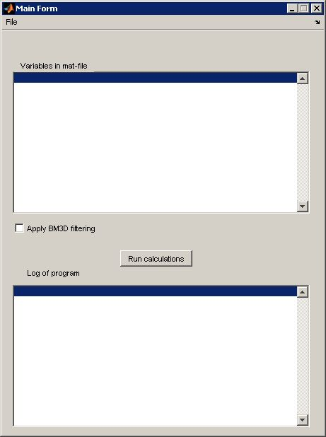
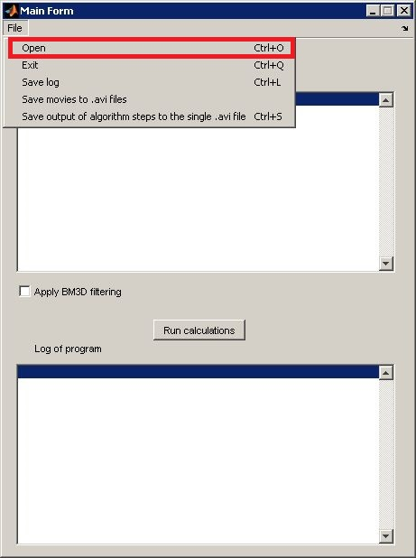
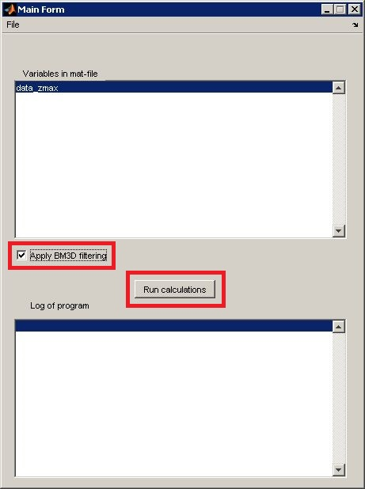
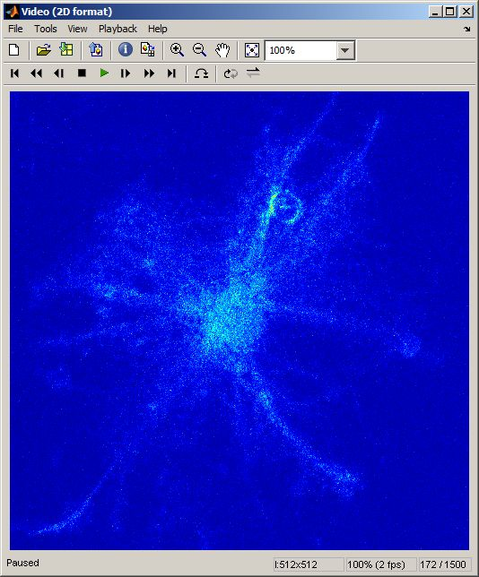
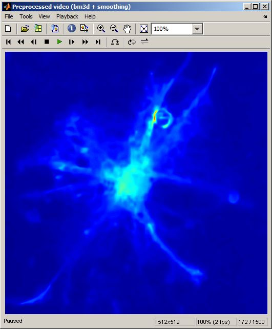
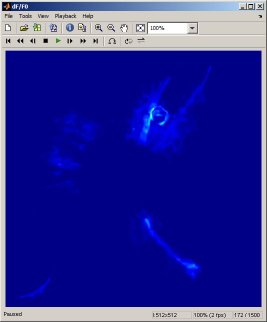
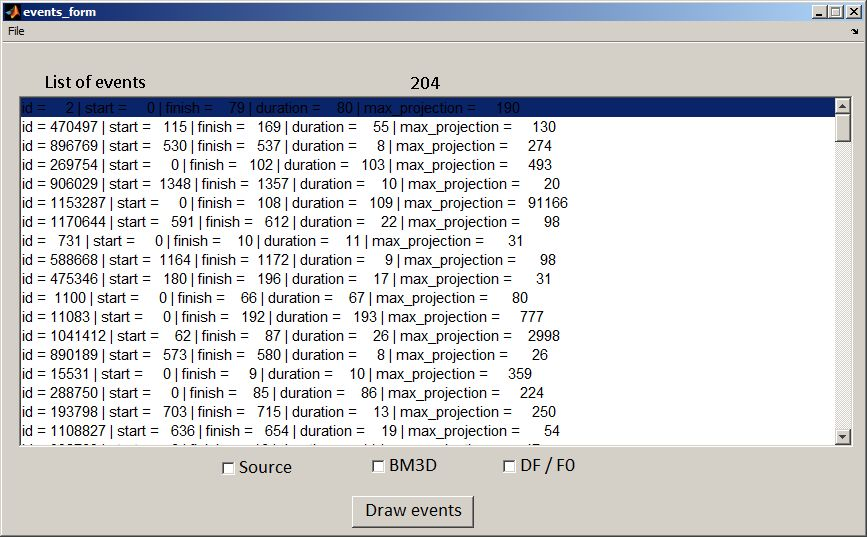
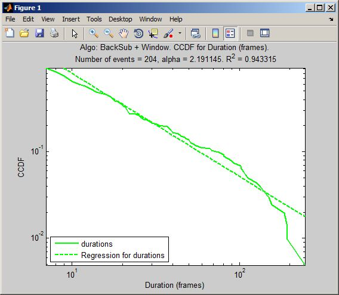
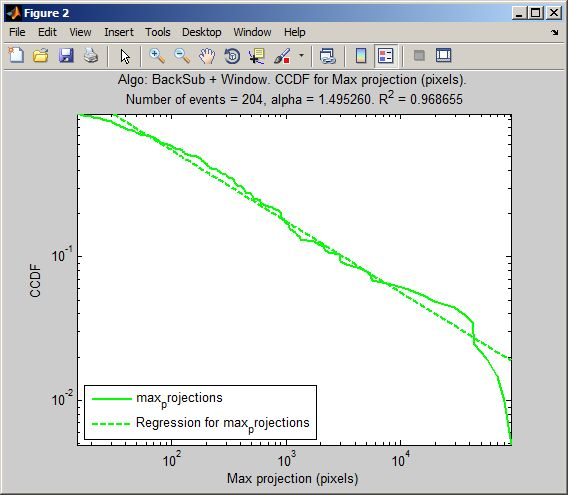
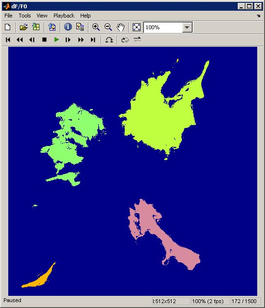

## Structure

This directory contains matlab-scripts:

  1. `astrocyte_research.m` - function contained full loop of astrocyte analysis.
  1. `main_form.fig`, `main_form.m` - GUI application for astrocyte analysis.
  1. `calc_events_info.m` - function to calculate events information (first frame, 
     last frame, duration, maximal projection, volume).
  1. `calc_statistics.m` - function to calculate power law degree.
  1. `convert_imgs2mat.m`, `convert_tif2mat.m` - auxiliary scripts for convert
     set of images as mat-object.
  1. `disp_conf_parameters.m` - auxiliary script to display algorithm parameters
     (for GUI application).
  1. `events_form.fig`, `events_form.m` - GUI application to represent
     events information and to show events.
  1. `implay_map.m` - function to play video and adjust the color map.
  1. `info_log.m` - function to log actions (for GUI applications).
  1. `norm_data.m` - function to normalize data.
  1. `parse_config.m` - function to parse configuration file contained algorithm
     parameters.
  1. `save_events_info.m` - function to save events information to file in csv-format.
  1. `save_imgs2avi.m` - function to save array of images to avi-file.
  1. `save_log.m` - function to application log represented in GUI application.
  1. `save_results2video.m` - function to save initial data, preprocessed data, df/f0 video
     and events video to the single avi-file (in `merged` mode) and to the separated files
     (in `splitted` mode).
  1. `video_bm3d.m` - function contained BM3D call.
  1. `view_all_distribution.m` - function to draw distributions for event
     durations and maximal projections.
  1. `view_events.m` - function responsible for event representation at
     the set of frames.
  1. `parse_config.m` - function to parse configuration file contained
     paths to binary files.
  1. `config.txt` - template of configuration file.
  1. `save_events_info.m` - function for saving events information.

## User's Guide (GUI Application)

  1. Open configuration file `matlab_scripts\config.txt`.  
  1. Change paths to binary files of Boost, Matlab and OpenCV:
  
  ```
  BOOSTBINPATH = 'C:\boost_1_60_0\lib64-msvc-14.0'
  MATLABBINPATH = 'C:\Program Files\MATLAB\R2010a\bin\win64'
  OPENCVBINPATH = 'C:\Program Files\opencv2411\vs2015\bin\Release'
  ```
  
  1. Change paths to compiled mex-files and bm3d implementation:
  
  ```
  MEXPATH = 'C:\astro-analysis\astro-analysis-build\bin'
  BM3DPATH = 'C:\astro-analysis\BM3D'
  ```
  
  1. Change algorithm parameters:
  
     - `THRESHOLDDFF = 12` - threshold for background subtraction
        (prefferable value changes in the range from 10 to 20);
     - `WINDOWSIDE = 5` - side of sliding window (takes value 4, 5, 6).
        Note: 5 is recommended value;
     - `MINPOINTS = 3`, `EPS = 3` - DBscan parameters. Note: (3, 3)
        is recommended pair of values;
     - `THRESHOLDAREA = 0.5` - minimal part of intersection area to think
        of the pixels placed in the top left corners belong to the same event;
     - `THRESHOLDTIME = 0.1` - minimal part of time period intersection to think
        of the pixels placed in the top left corners belong to the same event;
     - `MINAREA = 10` - number of pixels corresponding the minimum event area;
     - `MINDURATION = 7` - number of frames corresponding the minimum event duration;
  
  1. Save changes in `matlab_scripts\config.txt`.  
  1. Open Matlab Command Window.
  1. Execute `main_form` application (fig. 1).
  
  
  
  Fig. 1. Main Form
  
  1. Open mat-file with images using main menu `File->Open` (or `Ctrl+O`, fig. 2).
     You will see variable name in the field `Variables in mat-file`.
  
  
  
  Fig. 2. Main menu
  
  1. In the field `Variables in mat-file` choose data that you want
     to analyze (fig. 1).
  1. Press checkbox `Apply BM3D filtering` if you have not yet apply BM3D
     filtering (fig. 3). Note: BM3D method works for a long time. Watch out
     for logs.
  
  
  
  Fig. 3. Buttons
  
  1. Press button `Run calculations` (fig. 3).
  1. In the field `Log of program` you will see current stage
     of astrocyte analysis (fig. 1).
  1. As a consequence of video processing you will see several forms:
  
     - `Video (2D format)` - initial video of astrocyte activity (fig. 4).
     
     
     
     Fig. 4. Initial video
     
     - `Preprocessed video (bm3d + smoothing)` - video processed by BM3D filter
       and smoothing (fig. 5).
     
     
     
     Fig. 5. Preprocessed video
       
     - `dF/F0` - base line for each frame (fig. 6).
     
     
     
     Fig. 6. Base line for each frame
     
     - `events_form` - form contained events information (fig. 7).
     
     
     
     Fig. 7. Events form
     
     - `Duration (frames)` - complementary cumulative distribution function (CCDF)
       for events durations (frames), fig. 8.
     
     
     
     Fig. 8. CCDF of duration
              
     - `Max projection (pixels)` - complementary cumulative distribution
       function (CCDF) for maximal projections (pixels), fig. 9.
     
     
     
     Fig. 9. CCDF of max projection
       
       
  1. Additional menu items of main form (fig. 2):
  
     - `Exit` (or `Ctrl+Q`) allows to exit application.
     - `Save log` (or `Ctrl+L`) saves all lines of the field `Log of program` to the text file.
     - `Save movies to .avi files` saves movies to the separated avi-files.
     - `Save output of algorithm steps to the single .avi file` (or `Ctrl+S`) saves movies
       to the single avi-file ([example](https://www.dropbox.com/s/qoxt4g9aeesa152/2013-05-22_fileNo03.avi?dl=0)).
  
  1. Additional menu items and possibilies of events form (fig. 7):
  
     - `Save events information` item saves events information to the text file in CSV-format.
     - Choose events form the `List of events` and data (checkbox `Source` meas initial data,
       `BM3D` means preprocessed data, `DF/F0` means df/f0 data) to draw set of interested
       events (fig. 10).
       
     
     
     Fig. 10. Constructed events
            
  

## User's Guide (Research Application)

To execute "sliding" window method you should perform the following steps:

  1. Open Matlab Command Window.
  1. Load mat-file contained astrocyte video:
  
  ```matlab
  input_data = load(<file_name>)
  ```
  
  1. Open configuration file `matlab_scripts\config.txt`.  
  1. Change paths to binary files of Boost, Matlab and OpenCV:
  
  ```
  BOOSTBINPATH = 'C:\boost_1_60_0\lib64-msvc-14.0'
  MATLABBINPATH = 'C:\Program Files\MATLAB\R2010a\bin\win64'
  OPENCVBINPATH = 'C:\Program Files\opencv2411\vs2015\bin\Release'
  ```
  
  1. Change paths to compiled mex-files and bm3d implementation:
  
  ```
  MEXPATH = 'C:\astro-analysis\astro-analysis-build\bin'
  BM3DPATH = 'C:\astro-analysis\BM3D'
  ```
  
  1. Change algorithm parameters:
  
     - `THRESHOLDDFF = 12` - threshold for background subtraction
        (prefferable value changes in the range from 10 to 20);
     - `WINDOWSIDE = 5` - side of sliding window (takes value 4, 5, 6).
        Note: 5 is recommended value;
     - `MINPOINTS = 3`, `EPS = 3` - DBscan parameters. Note: (3, 3)
        is recommended pair of values;
     - `THRESHOLDAREA = 0.5` - minimal part of intersection area to think
        of the pixels placed in the top left corners belong to the same event;
     - `THRESHOLDTIME = 0.1` - minimal part of time period intersection to think
        of the pixels placed in the top left corners belong to the same event;
     - `MINAREA = 10` - number of pixels corresponding the minimum event area;
     - `MINDURATION = 7` - number of frames corresponding the minimum event duration;
  
  1. Save changes in `matlab_scripts\config.txt`.  
  1. Construct events in astrocyte step-by-step using function `astrocyte_research`.
  
  ```matlab
  [data_2d_video, bm3d_video, preprocessed_video, df_f0_video, ...
    events_3d, events_info] = astrocyte_research(input_data.data_zmax, on_bm3d_filtering);
  ```
  
  
  Function `astrocyte_research` takes the following input parameters:
  
   - `input_video` - initial video (3d or 4d matrix, in the case of 4d matrix
     maximal projection will be computed);
   - `on_bm3d_filtering` - flag to turn on BM3D filtering (`true` - ON, `false` - OFF).
     Note: BM3D method works for a long time. Watch out for logs.
  
  
  Function `astrocyte_research` returns the following parameters:
  
   - `data_2d_video` - initial data;
   - `bm3d_video` - data after BM3D filtering;
   - `preprocessed_video` - data after normalization and smoothing;
   - `df_f0_video` - dF/F0 for each frame;
   - `events_3d` - constructed events, each event has it's own identifier (doesn't equal
     it's index!) and is represented as a set of points (x, y, t), where
     (x, y) - pixel placement, t - frame index;
   - `events_info` - computed events information (duration, maximal projection).
  
     