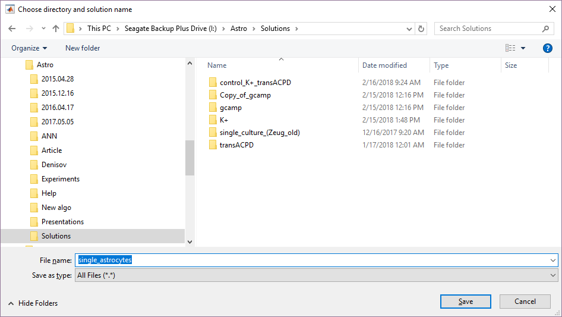

## Structure

This directory contains matlab-scripts:

  1. `core` - GUI, solutions and projects core, calculuses core.
  1. `calc` - algorithm implementation, functions for computing event parameters and generating final videos.
  1. `plot` - functions for data visualization.
  1. `save` - functions for export data to different formats.
  1. `config` - configuration file containing algorithm parameters, environment variables to link external libraries and some internal configurations.
  1. `auxiliary` - auxiliary functions for logging, storing data, converting formats, etc.
  1. `astro_lab_environment.m` - script to set environment variables.
  1. `run_astro_lab.m` - script to configure environment and execute main application (GUI interface).


## User's Guide (GUI Application)

  1. Open configuration file `matlab_scripts\config.txt`. 
  1. Change paths to binary files of Boost, Matlab and OpenCV:
  
     ```
     BOOSTBINPATH = 'C:\boost_1_60_0\lib64-msvc-14.0'
     MATLABBINPATH = 'C:\Program Files\MATLAB\R2010a\bin\win64'
     OPENCVBINPATH = 'C:\Program Files\opencv2411\vs2015\bin\Release'
     ```
  
  1. Change paths to compiled mex-files and bm3d implementation:
  
     ```
     MEXPATH = 'C:\astro-events-analysis\astro-events-analysis-build\bin'
     BM3DPATH = 'C:\astro-events-analysis\BM3D'
     ```
    
  1. Change algorithm parameters:
  
     - `THRESHOLDDFF = 12` - threshold for background subtraction
        (prefferable value changes in the range from 10 to 20);
     - `WINDOWSIDE = 5` - side of sliding window (takes value 4, 5, 6).
        Note: 5 is recommended value;
     - `MINPOINTS = 3`, `EPS = 3` - DBscan parameters. Note: (3, 3)
        is recommended pair of values;
     - `THRESHOLDAREA = 0.5` - minimal part of intersection area to think
        of the pixels placed in the top left corners belong to the same event;
     - `THRESHOLDTIME = 0.1` - minimal part of time period intersection to think
        of the pixels placed in the top left corners belong to the same event;
     - `MINAREA = 10` - number of pixels corresponding the minimum event area;
     - `MINDURATION = 7` - number of frames corresponding the minimum event duration;
     - `MEAN_WINDOW_SIZE` - parameter of baseline calculation step (window size in moving average implementation)
     - `DF_F0_K_SIGMA` - parameter of noise level estimation (coefficient of the standard deviation).
  
  1. Save changes in `matlab_scripts\config.txt`.
  1. BM3D filtering used VBM3D and it's default parameters from [bm3d].
     The noise level is taken as 40 (noise standard deviation assumed range is [0,255]).

  1. Open Matlab Command Window.
  1. Execute `run_astro_lab` application (fig. 1).
  
     
     
     *Fig. 1. Main form*

### Create new solution, new project and select data
  The project is a set of input movies, characteristics calculated for these movies and some auxiliary information.
  The solution is a set of projects.

  1. Create new solution (bundle of projects) using main menu `Solution->New solution` (fig. 2).
     
     
     
     *Fig. 2. Creating new solution*
     
     Choose directory and solution name (fig. 3). It creates directory `single_astrocytes`
     and `single_astrocytes/single_astrocytes.mat` solution file.
     
     
     
     *Fig. 3. Choosing solution directory*

  1. Create new project using main menu `Project->Add new project` (fig. 4)

     
     
     *Fig. 4. Add new project*
  
     You need for each project 2 movies (fig. 5):
        A. video with values of intensity in each pixel (for example calcium activity of astrocytes) (fig. 5 [1]),
        B. video with camera noise only (fig. 5 [2]).
       
     Each video data should have same dimensions HxW. Number of frames might be different.
     
     
     
     *Fig. 5. Add new project*
     
     Press `Browse...` (fig. 5) for each video (don't edit path) and import video (fig. 6).
     There are some possibilities for import data. 
     - At first, choose data format (fig. 6 [1]):
       * MAT - MAT-files are binary MATLAB® files that store variables (3 dimensional HxWxK). (fig. 7)
       * TIF - tif file with multiple images in one file. Each image should have equal dimensions HxW. (fig. 8)
       * Images list - separated images each in it's own file (png, bmp, jpg, tif). Each image should have equal dimensions HxW. (fig. 9)
     
     - Press `Browse...` (fig.6 [2]) and select file (files in case of images list).
       (Don't edit textbox `File list` and `Data location` by your self)
     
     
     
     *Fig. 6. Import video.*
     
     - Only in case of MAT choose variable from the list (fig. 6 [3], fig. 7).
     
     
     
     *Fig. 7. Import video from mat file.*
     
     
     
     *Fig. 8. Import tif.*
     
     
     
     *Fig. 9. Import images list.*
     
     - Check preview of your video data (fig. 6 [4]).
     
     - In case of colored tif or images choose channels (red, green, blue) that you need. (Fig. 6 [5]) Average of chosen colors in pixel will be used as intensity of pixel.
     
     - Check data size of selected data (fig. 6 [6]). (If something is wrong try changing data format or data shape)
     
     - Enter frames per second of video data and real size of images in  for height and width. (Fig. 6 [7])
     
     - Press `Select video data` (fig. 6 [8]).
     
     After choosing videos enter (or edit if you need) project name (fig. 5 [3]) and press `Create project` (fig. 5 [4]).

  1. Save solution using main menu `Solution->Save solution`.

### Calculating main steps of algorithms
  
  1. Now form looks as it is shown on fig. 10.
  
     
     
     *Fig. 10. Main form.*

     * Select project (or multiple projects using Ctrl/Shift keys) from project list (fig. 11 [1]).
     * Next select `Compare algorithms` radiobutton (fig. 11 [2]).
     * Select multiple calculuses from calculus list (1-10) (using Ctrl/Shift) (fig. 11 [3]).
       It's main steps for both algorithms.
     * Press `Calc` and wait (fig. 11 [4]).
     * Last row `*** Calculating project: single_astrocyte finished` in log window and in status bar informs you about calculation ending.

     
     
     *Fig. 11. Select calculuses.*
     
  1. Save solution using main menu `Solution->Save solution`.

### Event detection

  1. Check that necessary projects are selected.

  1. Next choose radiobutton for algorithm:
     * `ITMM algorithm` - calculating for ITMM algorithm only.
     * `Yu-Wei algorithm` - calculating for [Yu-Wei algorithm][yu-wei] only.
     * `Compare algorithms` - calculating for both algorithms with comparisons.

     We recommend choose last option (compare algorithms).

  1. Next choose from calculus list:
     * `Find events for different levels of threshold` - find events using ITMM algorithm for different thresholds.
     * `Find events` - find events using ITMM algorithm for automatic threshold ().
     * `Full algo (Yu Wei)` - find events using Yu Wei algorithm (constant threshold).
     * `Find events by dF/F0 from Yu-Wei algo` - find events using Yu-Wei dF/F0 and ITMM event detection (only events, no other calculus work for this).

     We recommend choose 1-3 options and press `Calc`.
     Wait before end of calculation process.

  1. Save solution using main menu `Solution->Save solution`.

### Calculating/exporting/plotting event parameters
  1. Calculate all remaining options. Select projects, select remaining calculuses, and press `Calc` (fig. 12[1-4]).
     
     
     
     *Fig. 12. Select remaining calculuses.*
     

  1. Export results. 

     After exporting export directory is created automaticaly in solution directory and called `<project_name>`.
     Inside export directory are created automaticaly 3 folders for each radiobutton (ITMM, Yu-Wei, Compare) (fig. 13).
     
     
     
     *Fig. 13. Folder structure.*
     
     Project data are saved in directory called `calculus_<project name>`.
     You shouldn't change project data if you not sure what you are doing.
         
     - Each main steps 1-15 produce and save some video data on your hard drive.
       If you choose some option of them and press `show` video player start and you can play video data (fig. 14[1-3], fig. 15).
       Another possibility - press `avi`, and video will be exported to project export directory.
     
     
     
     *Fig. 14. Show dF/F0 video.*

     
     
     *Fig. 15. Video player.*
     
     - Almost all of remaining calculuses (16-61) can be exported as png (button `png`) and shown (button `show`) as image or graph. Examples is shown fig. 16-18.
     
     
     
     *Fig. 16. Projection of maximum intensity.*
     
     
     
     *Fig. 17. Percent luminiscence per frame.*
     
     
     
     *Fig. 18. Duration statistics.*
     
     - Also this data can be exported as MAT-files (button `mat`) or as comma-separated values (button `csv`). 
     
     On fig. 19 shown example of exported MAT and PNG files for some project.
     
     
     
     *Fig. 19. Exported data.*
     

[yu-wei]: https://www.ncbi.nlm.nih.gov/pubmed/24484772
[bm3d]: http://www.cs.tut.fi/~foi/GCF-BM3D